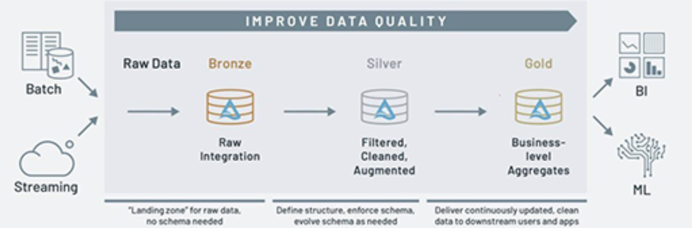
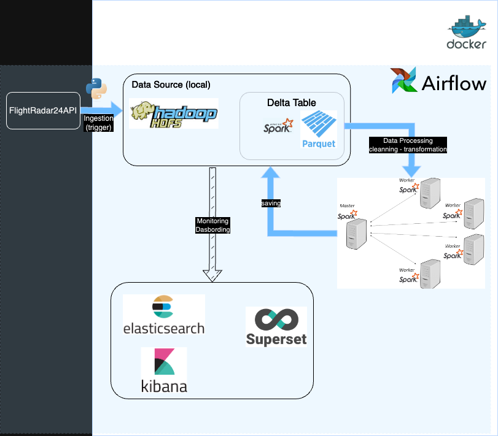

# Le projet - FlightRadar24
L'objectif est de fournir un pipeline robuste, évolutif et maintenable pour l'ingestion, le traitement, le stockage et l'analyse des données de vols. Cette architecture inclut des composants pour l'ordonnancement, le monitoring, le data modeling, et d'autres aspects essentiels à une solution de production.

## Environnement 
L'ensemble des pipelines ETL (Extract, Transform, Load) permettant de traiter les données de l'API [flightradar24](https://www.flightradar24.com/), qui répertorie l'ensemble des vols aériens, aéroports, compagnies aériennes mondiales, suppose qu'on ait un environnement `HDFS` bien mis en place en local pour le stockage des données brutes.
On a choisi d'utiliser `Hadoop` en raison de sa capacité à gérer et à traiter de grandes quantités de données de manière efficace. Notamment, l'utilisation de `HDFS` pour stocker de grandes quantités de données de manière distribuée. Pour des soucis d'espace mémoire du conteneur, on a mis en  palce `HDFS` en local. Donc cela signifie qu'il ne sera pas explicitement présent dans le fichier `Dockerfile`.
Par la suite on décide aussi d'utiliser `Apache Airflow`, un outil puissant pour la gestion et l'orchestration des workflows. Il sera utilisé principalement pour planifier, organiser et surveiller nos workflows.
Concernant le traitement distribué des données, on utilise `Apache Spark`.

Le projet suit une architecture en médaillon. 

source : google

De manière plus détailler :


## Projet 
Le projet est fonctionnel et opérationnel. Pour le lancer veuillez suivre les étapes suivantes : 

Prérequis : 
    * HDFS
    * docker 
    * Terminal 

- Dans le terminal, accéder à la racine du projet et lancer la commande `docker-compose up -d`.
- Si le webserver de airflow ne se lance pas correctement veuillez redémarrer seulement ce service.
- Sur le werserver de airflow (accès par : `http://localhost:8080/`) > `admin` > `connections` > `add new record` >> `connection id`:`spark-conn`, `host`:`spark://spark-master`, `port`:`7077`
- lancer le dags

## Dags et Jobs
On trouvera 2 principaux dags qui répondent aux questions du kata : 
- flight-detail-extraction avec les jobs suivants :
    * ```start >> extract_flight_job >> clean_flight >> [current_flight_by_airline, aircraft_company_flight] >> regional_flight >> [longgest_flighttime,longgest_flight_distance] >> end```
- flight-detail-extraction-p2 avec les jobs suivants :
    * ```start >> [in_out_flight, aircraft_by_airline_country] >> end```


## Le processus de la donnée
- On récupere tout d'abord les données de l'API fournit. Après une étude approfondie de l'API et des données nous allons nous concentrer essentiellement sur l'étude détaillée de chaque vol à l'aide des commandes suivantes : 
```flight_details = fr_api.get_flight_details(flight)```
```flight.set_flight_details(flight_details)```
Ces fonctions sont appelés dans une `class Extraction` où on y inclut aussi les autres extractions possible (`fr_api.get_flights()`, `fr_api.get_airline()`, `fr_api.get_airport()`) dans le cas où des questions en rapports avec ces extractions sont demandés. 
Il faut savoir aussi que l'appelle de la méthode `fr_api.get_flight_details(flight)` dans une boucle `for` prend du temps (environs 5min avec la version gratuite, inconnue avec la version complète).
- On fixe un schéma avant de créer le dataframe, cela nous evitera des soucis d'incompatibilité liés aux types des données. 
- On enregistre sans modification apparente dans une `delta table` en partitionnant en fonction de la date, et heure.
- On procède ensuite à la phase de `data cleaning`. On supprime les colonnes qu'on considère inutilisable par manque de donnée et celles qui n'ont à priori pas de rapport avec le vol actuellement en cours (`aircraft_history`: pour un aircraft donnée cette colonne peut retracer les données des vols précédemment parcouru). On supprime aussi les lignes pour lesquelles il manque des clés à savoir (`iata`, `icao` pour l'arrivée et le depart, `aircraft_code`, `id`) car ses clés sont essentielles pour répondre aux questions.
- On enregistre les données nettoyées dans une autre `delta table` en suivant le principe de `SCD (Slowly Changing Dimension)` type 2 par le biai de la bibliothèque `mack`.
- On se basera toujours par rapport à cette table qui a été nettoyé pour répondre aux questions.

## Tests
Les tests se font avec la bibliothèque `pytest` et la génération des API avec `unittest`.
Mis en place de test sur la partie des méthodes se trouvant dans le dossier `utils/` utilisées pour les jobs se trouvant dans `etls/`.
- Création de mock pour simuler une `API` car la `class Extraction` requiert l'appel d'une `API`.
- Tentative de mise en place d'un système de `coverage` avec les fichier `pytest.ini` et `.gitlab-ci.yml`.

## Résultats
Ce pipeline doit permettre de fournir les indicateurs suivants:
1. La compagnie avec le + de vols en cours
2. Pour chaque continent, la compagnie avec le + de vols régionaux actifs (continent d'origine == continent de destination)
3. Le vol en cours avec le trajet le plus long
4. Pour chaque continent, la longueur de vol moyenne
5. L'entreprise constructeur d'avions avec le plus de vols actifs
6. Pour chaque pays de compagnie aérienne, le top 3 des modèles d'avion en usage
Questions Bonus: Quel aéroport a la plus grande différence entre le nombre de vol sortant et le nombre de vols entrants ?

Tout d'abord, en prenant connaissance des questions on peut remarquer qu'elles sont toutes indépendantes.
- Utilisation de la méthode `get_flight_details` pour répondre aux questions car les autres méthodes donnent certes des informations mais nous ne savont pas précisement si pour un vol donnée celui-ci est en cours ou non.
> Exemple : 
Pour la méthode `get_flights`, nous avons la colonne `on_ground` or celle-ci ne signifie absolument pas que l'avion est en cours car il peut très bien être au sol soit en train de décoller soit en train d'atterir et nous ne connaissons l'heure d'arrivée exacte. Donc manque d'information.

- `Vol en cours` : On considérera pour la suite qu'un vol est dit `en cours` s'il est soit au sol mais sur le point de decoller soit déjà dans les airs. S'il est au sol mais a attérit alors il ne sera pas considéré `en cours`. Ceci est justifier par le fait que les calculs des distances sont fait entre les coordonnées de(s) l'aéroport(s) et/ou de l'avion.

- La bibliothèque `mack` permet de mettre à jour une `delta table` en fonction d'une clé primaire en suivant le principe de `SCD type 2`; pour une ligne donnée elle attribut un booléen à `is_current` qui signifie si elle est toujours d'actualité ou non. 
En temps normal, la ligne est censé retourner `False` quand l'avion attérit mais pour notre table c'est assez particulier. 
En effet n'ayant qu'une version gratuite, nous n'avions pas l'accès total des données donc nous ingérons en continue des données mais il est très probable qu'entre 2 ingestions nous n'arrivons pas à attraper les mêmes données.
Donc il est très probable qu'un vol ne soit jamais `is_current==True`. 
De plus notre ingestion se fait toutes les 2 heures cela aussi peut être une raison du problème évoqué. 
Pour pallier à cela on compare l'heure d'arrivée de l'avion dans son aéroport d'arrivé et l'heure actuelle.

- Les indicateurs 1 - 2 - 5 - 6 sont assez triviales.
- Indicateurs 3 : La trajectoire n'étant pas toujours une ligne droite entre deux points, des détours peuvent être nécessaire pour éviter des turbulences, des espace de zones aériens restreints, etc... En prenant en compte ses éléments la distance et la durée d'un vol n'ont pas vraiment de corrélation. Donc l'indicateur est assez ambigu.
* En distance : 2 choix à savoir la distance entre le départ et l'arrivée ou bien la distance entre le départ et le moment où la donnée a été récupéré. Dans les deux cas on utilisera la formule d'`Haversine`. Ceci est le calcul approximatif entre 2 points. Si on souhaite un résultat plus précis il aurait fallut récupérer la colonne `trail` et utilisé la formule d'`Haversine` de manière cummulé à chacun des points. 
Mais nous avons décider de nous restreindre à une seule application de la formule pour les mêmes raisons que celles de la mise à jour d'une `delta table`. (manque de donnée et le temps d'ingestion)
* En temps : 2 choix à savoir le temps entre le départ et l'arrivée ou bien le temps entre le départ et le moment où la donnée a été récupéré.  
Seuls les cas 1 (distance/temps entre le départ et l'arrivée) ont été traité. Les cas 2 sont identiques aux cas 1 dans la manière de procéder. 
- Indicateurs 4 : ici sans ambiguité on traitera seulement de la distance en km.

On recupèrera l'ensemble des resultats grâce à la fonction `get_all_result_locally.py`

## Amélioration futur
* Par manque de temps, il a été plus facile de configurer HDFS en local que sur un docker car nous avons rencontrer des problèmes de compatibilité concerant les différentes images.
* Il aurait fallut mettre en place un système de monitoring à l'aide de `Grafana` (pour surveiller la santé et la performance du système) et `ELK Stack`((Elasticsearch, Logstash, Kibana) pour la gestion et l'analyse des logs).
D'autre part, à cause d'un manque de connaissance concernant la mise à disposition et la gestion des ressources, il m'a été impossible de lancer tous mes dags simultanément. 

* Mettre en place un système de dashboarding pour les différents indicateurs. 
Exemple : 
Récupérer à l'aide de `Apache Superset` (ou PowerBi mais payant) la table nettoyée puis faire les requêtes nécessaires pour récuperer les indicateurs demandés.
Pour mettre en place ce système de dashbording, créer un job qui permettra de lire la table qui a été nettoyer, puis la mettre à jour correctement (voir explication Résultat- La bibliothèque `mack`) et enfin enregistrer cette nouvelle table dans une base de donnée. 
Récuperer les donnée de cette table dans la base via superset et lancer les requêtes.
Il est surement possible de directement récuperer directement les données via hive2 (à voir).


* Si une meilleure gestion était possible il aurait fallut créer seulement un dag de la manière suivante :
- flight-detail-extraction : 
    * ```start >> extract_flight_job >> clean_flight >> [current_flight_by_airline, aircraft_company_flight, regional_flight, longgest_flighttime, longgest_flight_distance, aircraft_by_airline_country, in_out_flight] >> end```

* Par manque de connaissance concernant la sécurité des données, je n'ai pas pu mettre en place un système de cryptage des données en transit et au repos et un système de gestion des permissions et des rôles pour restreindre l'accès aux données sensibles.

* Amélioration drastique des resultats si on avait ajouter du streaming avec Apache Kafka et accessibilité compléte des donnée dans notre ETLs.